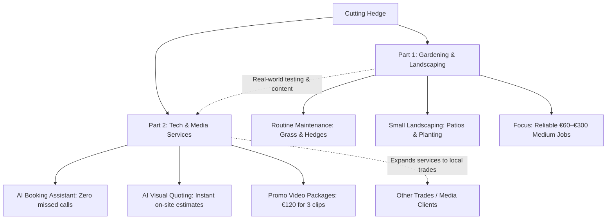

# Cutting Hedge — Business Overview

## 1. Identity & Location
* **Business Name:** Cutting Hedge
* **Owner / Operator:** John Snel (Sole Trader)
* **Location:** Skerries & North County Dublin (20–30 min radius)
* **Contact & Web:** 083 838 4740 • cuttinghedge.ie
* **Support Scheme:** Back to Work Enterprise Allowance (BTWEA)

---

## 2. The Two-Part Business Model

---

## 3. Core Services & Pricing Structure
* **Short Maintenance Visit (1–2 hrs):** €60 – €80
* **Full-Day Garden Tidy (6–8 hrs):** €180 – €300
* **Small Patio / Paving:** From €500
* **AI Promo Video Package (3 social clips):** €120
* **Tradesperson Landing Page / Booking Web App:** €150 – €350+

---

## 4. Key Differentiators & Qualifications
* **Greenkeeper-Level Craft:** Deer Park greenkeeping experience + Teagasc horticulture + Australian landscaping background.
* **Solves the #1 Customer Complaint:** Instant AI call handling and digital booking eliminate delays and ghosting.
* **Instant AI Quoting & Visuals:** Generates realistic "finished garden" previews on-site for immediate, accurate pricing.
* **Dual-Revenue Engine:** Real gardening projects generate video content to sell digital packages to local trades.

---

## 5. Year 1 Financial Target
* **Weekly Delivery:** 2 full days gardening (€600) + 2 short visits (€140) + 1 digital project (€160) = **€900/week**
* **Projected Annual Gross Revenue:** **€43,200** (48 active weeks)
* **Estimated Annual Overheads:** ~**€12,050** (van, fuel, equipment hire, insurance, marketing)
* **Projected Net Profit:** ~**€31,150**
