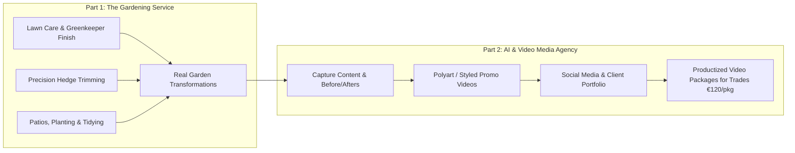

# Cutting Hedge — Business Overview & Video Production Strategy

## Executive Summary
- **Business Name:** Cutting Hedge
- **Founder:** John Snel
- **Location:** Skerries & North County Dublin
- **Contact:** 083 838 4740 | cuttinghedge.ie
- **Scheme:** Back to Work Enterprise Allowance (BTWEA)

---

## The Dual-Engine Business Model

### 1. Gardening & Landscaping Service
- **Core Offerings:** Grass cutting, precision hedge trimming, patios, planting, tidy-ups, artificial grass.
- **Key Differentiators:** 
  - Greenkeeper-level training (Deer Park) + Teagasc horticulture.
  - Specializes in reliable, high-demand medium jobs (€60–€300) where larger firms or overbooked operators drop the ball.
  - Fast response, instant AI visual estimates, and digital booking.

### 2. Tech & Media Service
- **Core Offerings:** 
  - AI-enhanced promo video packages (e.g., 3 short clips from one project for €120).
  - Before-and-after showcase videos.
  - Booking & quoting web apps for local trades.
- **Strategy:** Cutting Hedge serves as the flagship portfolio and proving ground to sell high-margin media packages to other trades.

---

## Brand Visual Identity & Assets
- **Logo Icon:** Low-poly faceted green hedge (`assets/polyart_hedge_logo.png`)
- **Founder Avatar:** Grayscale/monochromatic faceted low-poly portrait with headphones and closed eyes (`assets/polyart_self_portrait.png`)
- **Visual Style:** 3D Low-Poly / Faceted Vector Motion Graphics — geometric, clean, modern, tactile.
- **Core Themes:** Precision Craft, Peace of Mind & Wellbeing, Reliable Local Service.
